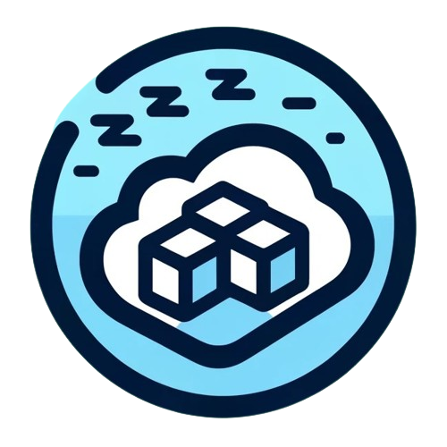
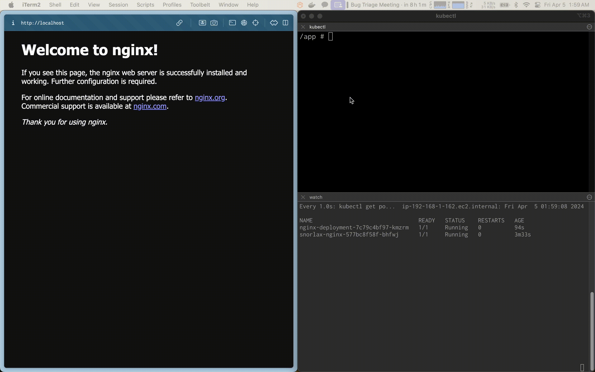

<div align="center">
  
</div>

# Snorlax

Snorlax is a Kubernetes operator which wakes and sleeps another Kubernetes deployment on a schedule.

And if a request is received when the deployment is sleeping, a cute sleeping Snorlax page is
served and the Kubernetes deployment is woken up. Once the service is ready, the page will auto-refresh.

You create `SleepSchedule` resources to define the schedule for any deployment (and optionally it's ingress).


## See it in action




## Usage

1. Install the `snorlax` Helm chart to install the `SleepSchedule` CRD and controller
    ```bash
    helm repo add moon-society https://moon-society.github.io/helm-charts
    helm repo update
    helm install snorlax moon-society/snorlax --create-namespace --namespace snorlax
    ```

2. Create your `SleepSchedule` resource to define the schedule for the deployment
    ```yaml
    # your-app-sleep-schedule.yaml

    apiVersion: snorlax.moon-society.io/v1beta1
    kind: SleepSchedule
    metadata:
      namespace: your-app-namespace
      name: your-app
    spec:
      wakeTime: '8am'
      sleepTime: '10pm'
      timezone: 'America/New_York'
      deploymentName: your-app-deployment
      wakeReplicas: 3
      ingressName: your-app-ingress
    ```

3. Apply the `SleepSchedule` resource
    ```bash
    kubectl apply -f your-app-sleep-schedule.yaml
    ```

## How to develop

tbd

## Future work

- Scale entire namespaces
- Sleep when no requests are received for a certain period of time
- Add support for custom wake and sleep actions (e.g. hit a webhook on wake)
- Add support for cron-style schedules (e.g. `0 8 * * *`)
- Add button to manually wake up the deployment (instead of auto-waking on request)
